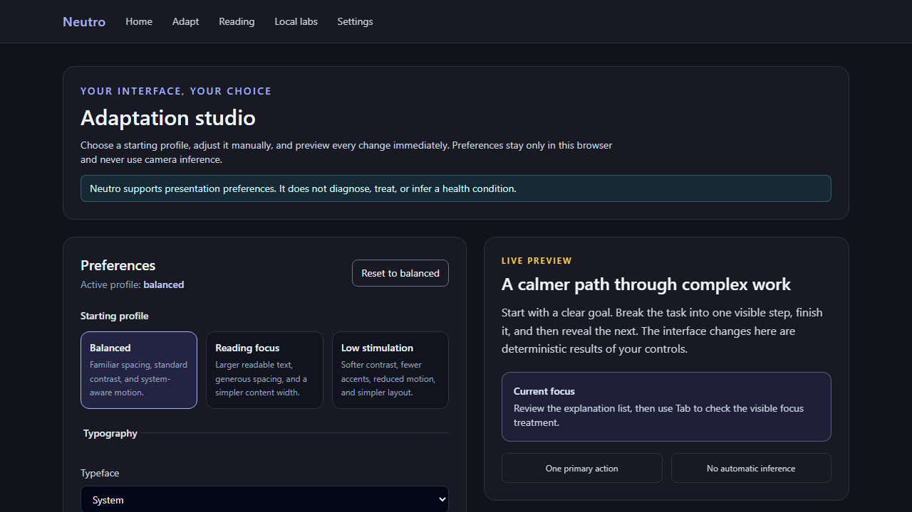

# Neutro

> **Release candidate:** a local-first, user-controlled interface adaptation prototype. The canonical app is `apps/web`; legacy root modules are retained but unsupported.

[](docs/demo/demo.mp4)

[Play MP4](docs/demo/demo.mp4) · [Download WebM](docs/demo/demo.webm) · [Captions](docs/demo/demo-captions.vtt) · [Portfolio case study](https://jashwanth-portfolio-ten.vercel.app/work/neutro/)

The 3:15 walkthrough is a real browser run with narration, captions, deterministic built-in content, and no camera, account, file import, or private data.

Neutro turns explicit presentation choices into deterministic interface changes. A user can choose a profile, tune every supported dimension, preview the result, understand why it changed, reload with preferences intact, and reset locally.

## Primary workflow

1. Open **Adapt** and choose Balanced, Reading focus, or Low stimulation.
2. Tune typography, contrast, motion, sensory load, layout, and focus assistance.
3. Confirm that manual changes switch the active state to **Custom**.
4. Review the live preview and plain-language explanation for every active setting.
5. Reload to confirm local persistence, then reset to Balanced.

The workflow uses native labeled controls, visible keyboard focus, an announced status summary, and the operating system's reduced-motion preference. Neutro never forces full motion.

## Honest boundaries

- Neutro supports presentation preferences. It does not diagnose, treat, or infer a health condition.
- Profiles are transparent presets, not recommendations or medical classifications.
- Preferences are stored in browser `localStorage`; there is no account or cloud sync in the canonical app.
- Camera input is off by default. The optional camera lab uses unvalidated heuristic labels, never changes adaptation preferences, and is not emotion recognition.
- Session replay starts only after a user action and remains in local browser storage.
- No production-user, clinical-validation, therapeutic-outcome, or cross-platform parity claim is made.

## Run the canonical app

Requires Node.js 22 and npm.

```bash
cd apps/web
npm ci
npm run dev
```

Vite prints the local URL. No credentials are required for the primary workflow.

## Verify

```bash
cd apps/web
npm run lint
npm test
npm run build
npm audit --audit-level=low
```

CI installs and verifies both repository trees, and now enforces the canonical adaptation tests. Detailed evidence is recorded in [PROJECT_COMPLETION_REPORT.md](PROJECT_COMPLETION_REPORT.md) and [docs/TEST_REPORT.md](docs/TEST_REPORT.md).

## Routes

- `/` — product thesis and primary entry point
- `/adapt` — profiles, manual controls, preview, explanations, and reset
- `/reading` — optional local reading workspace
- `/replay` — opt-in local session replay lab
- `/demo/mood-motion` — optional experimental camera-signal lab
- `/settings` — local data and environment status

## Repository map

```text
apps/web/src/
├── components/AdaptationProvider.tsx   # persistence + document-level effects
├── lib/adaptation/preferences.ts       # pure presets, validation, and explanations
├── pages/AdaptationPage.tsx            # primary workflow
├── pages/ReadingPage.tsx               # optional reading tools
├── pages/ReplayPage.tsx                # opt-in local replay
└── pages/MoodMotionPage.tsx             # experimental local camera lab
```

See [docs/ARCHITECTURE.md](docs/ARCHITECTURE.md), [SECURITY.md](SECURITY.md), and [docs/DEVELOPMENT.md](docs/DEVELOPMENT.md) for implementation and trust-boundary details.
