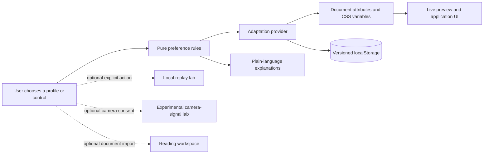

# Neutro architecture

Neutro's canonical product is a client-side React application in `apps/web`. Its primary boundary is intentionally small: explicit user preferences become deterministic presentation changes in the same browser.

## System view

## Adaptation boundary

- `lib/adaptation/preferences.ts` owns presets, input normalization, numeric bounds, custom overrides, safe storage parsing, and explanations. These rules are pure and tested.
- `AdaptationProvider.tsx` observes system reduced motion, persists normalized state, and maps it to document `data-*` attributes and CSS variables.
- `AdaptationPage.tsx` uses semantic fieldsets, labels, native inputs, pressed states, a live preview, a reset action, and an `aria-live` summary.
- Manual changes always create a custom profile. Reset returns to a balanced profile that follows system motion; there is no "force motion" state.

## Data and trust boundaries

| Data | Storage / processing | Boundary |
|---|---|---|
| Adaptation preferences | Versioned browser `localStorage` | Local to the current browser profile |
| Imported reading document | Browser memory | User-selected file; no upload in canonical flow |
| Replay events | Browser storage | Opt-in only; may contain rendered page content |
| Camera frames | In-memory, on-device processing | Permission required; frames are not intentionally persisted |
| Camera-derived labels | Browser memory and optional replay markers | Experimental and unvalidated; not used for adaptation |

Malformed preference storage falls back to safe defaults. Optional modules are route-split and are not required to load the primary workflow.

## Unsupported paths

Legacy root modules and optional Tauri/Supabase artifacts are outside the canonical runtime and release claim. There is no verified desktop distribution, account service, cloud synchronization, clinical validation, or automatic preference inference.
