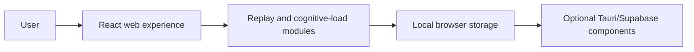

# Neutro architecture

Cognitive-safety toolkit exploring replay, reading assistance, load-aware intervention, and privacy-preserving desktop telemetry.

## System view

## Component boundaries

- **User:** initiates the primary workflow.
- **React web experience:** owns one stage of the request or interaction flow.
- **Replay and cognitive-load modules:** owns one stage of the request or interaction flow.
- **Local browser storage:** owns one stage of the request or interaction flow.
- **Optional Tauri/Supabase components:** provides the terminal integration or persistence boundary.

## Runtime and trust boundaries

Lint failures require lifecycle design decisions; desktop and Supabase components were not built or deployed in this audit. Inputs crossing a network, filesystem, provider, or database boundary should be validated and logged without sensitive values. Optional integrations must fail clearly rather than being presented as successful.

## Technology

React, TypeScript, Vite, rrweb, Tauri/Rust, Supabase functions.

